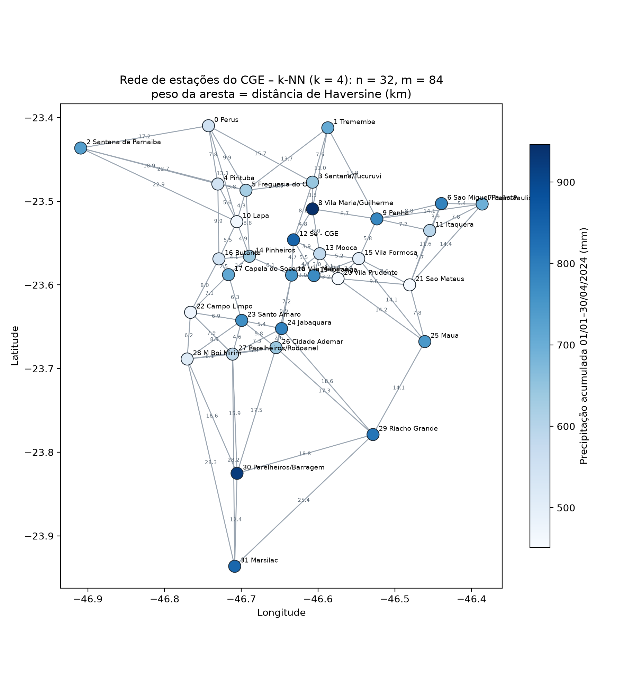

# Análise de Padrões Climáticos em uma Rede de Estações Meteorológicas por meio da Teoria dos Grafos

Projeto da disciplina **Teoria dos Grafos** – Universidade Presbiteriana Mackenzie,
Ciência da Computação, turma 6ºG – Prof. Dr. Ivan Carlos Alcântara de Oliveira.

| Integrante | RA |
|---|---|
| Vinícius Pereira Rodrigues | 10729470 |

## O problema

A rede de estações meteorológicas automáticas do **CGE** (Centro de Gerenciamento de
Emergências Climáticas da Prefeitura de São Paulo) é modelada como um grafo para estudar
como as estações se relacionam no espaço. O objetivo é identificar agrupamentos, estações
centrais e estações com comportamento discrepante em relação às suas vizinhas, usando
somente conceitos e algoritmos de Teoria dos Grafos.

## Modelagem

| Elemento | Definição |
|---|---|
| Vértice | Estação do CGE (32 estações) – rótulo: nome da estação |
| Peso do vértice | Precipitação acumulada (mm) de 01/01/2024 a 30/04/2024 |
| Aresta | Vizinhança geográfica: k vizinhos mais próximos (k = 4), simetrizada |
| Peso da aresta | Distância de Haversine (km) |
| Categoria | **Tipo 3** – não orientado, com peso nos vértices e nas arestas |

Resultado: **n = 32, m = 84**, grafo conexo, grau entre 4 e 7.



## Estrutura

```
grafo.txt                    grafo modelado (formato do enunciado)
src/grafo.py                 classe Grafo (lista de adjacência) – base: classe de aula
src/main.py                  aplicação com o menu a) a j)
src/prepara_dados.py         leitura dos CSVs do CGE e agregação na janela comum
src/gera_grafo.py            regra k-NN + Haversine -> grafo.txt e dados/estacoes.graphml
src/analise_preliminar.py    métricas estruturais e comparação com a vizinhança
src/figuras.py               figura do grafo e imagens das saídas dos testes
dados/estacoes_resumo.csv    atributos agregados por estação
dados/estacoes.graphml       grafo para abrir no Gephi (com latitude/longitude)
testes/roda_testes.py        2 testes por opção do menu (saídas em testes/saidas/)
testes/grafo_orientado.txt   dígrafo de exemplo para conexidade C0–C3 e grafo reduzido
docs/                        relatório (docx/pdf) e rubrica
```

## Como executar

Requer Python 3.10+. A aplicação e os testes usam apenas a biblioteca padrão.

```bash
python src/main.py               # aplicação (menu)
python testes/roda_testes.py     # executa os testes e grava testes/saidas/
python src/gera_grafo.py [k]     # regenera grafo.txt a partir de dados/estacoes_resumo.csv
python src/analise_preliminar.py # resultados parciais
```

Scripts opcionais (precisam de `pip install -r requirements.txt`):

```bash
python src/prepara_dados.py <pasta_csvs_cge_2024>   # recria dados/estacoes_resumo.csv
python src/figuras.py                               # recria as figuras
```

## Menu da aplicação

```
a) Ler dados do arquivo grafo.txt        f) Remover aresta
b) Gravar dados no arquivo grafo.txt     g) Mostrar conteúdo do arquivo
c) Inserir vértice                       h) Mostrar grafo (lista de adjacência)
d) Inserir aresta                        i) Conexidade do grafo e grafo reduzido
e) Remover vértice                       j) Encerrar a aplicação
```

## Relatório

[docs/Relatorio_Projeto_TG_Parte2_VINICIUSRODRIGUES.pdf](docs/Relatorio_Projeto_TG_Parte2_VINICIUSRODRIGUES.pdf)

## Vídeo

Link do YouTube: *(será adicionado na Parte 3)*
